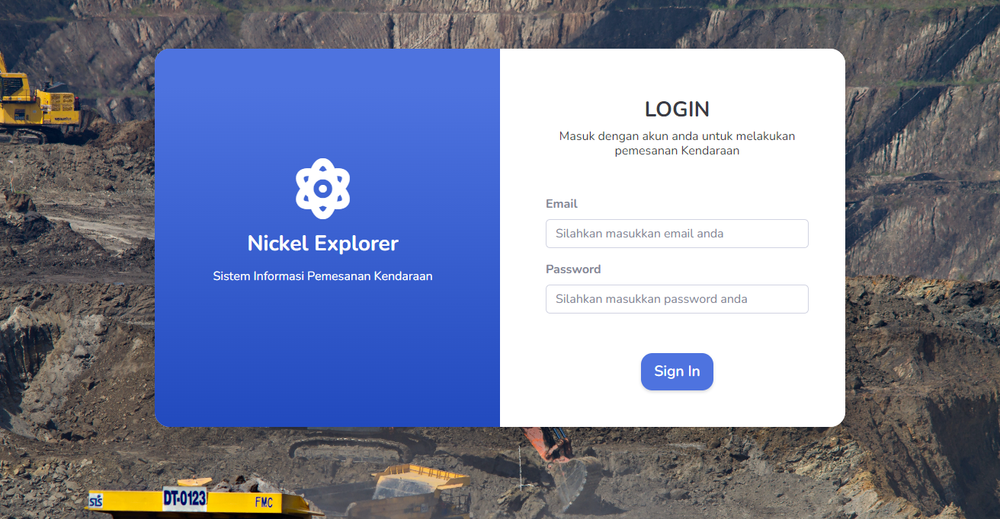
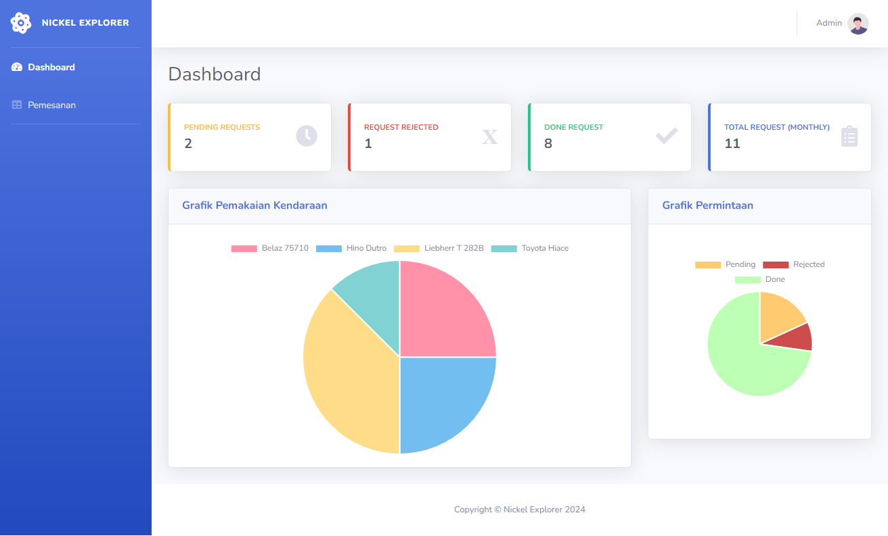
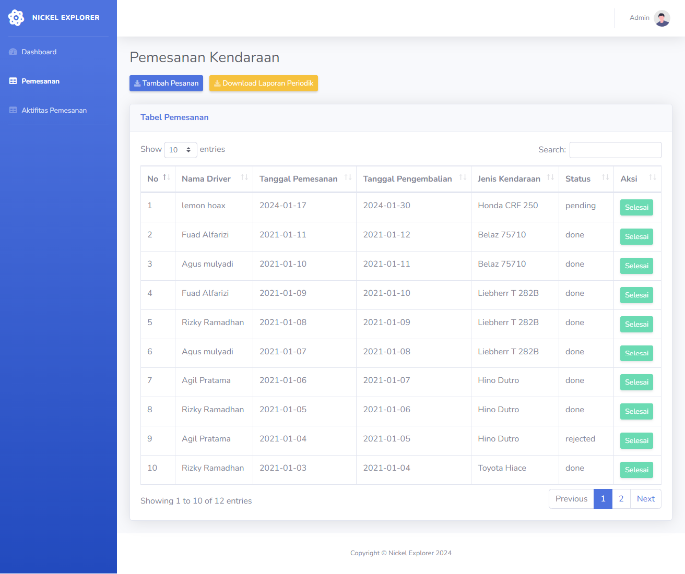
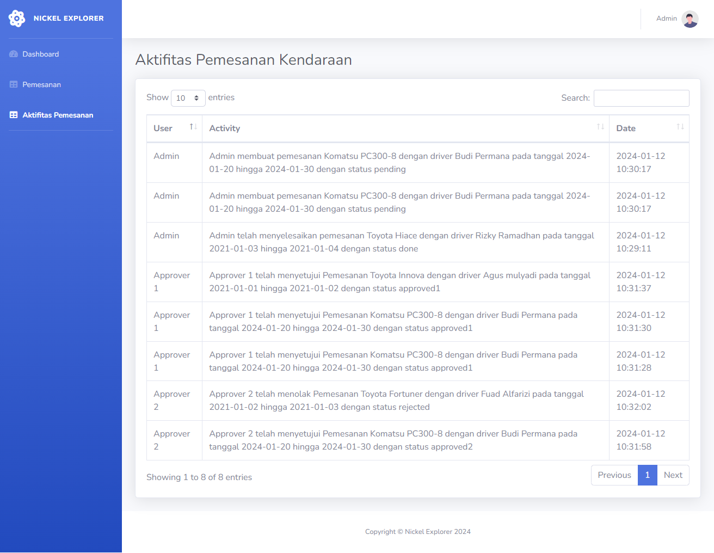
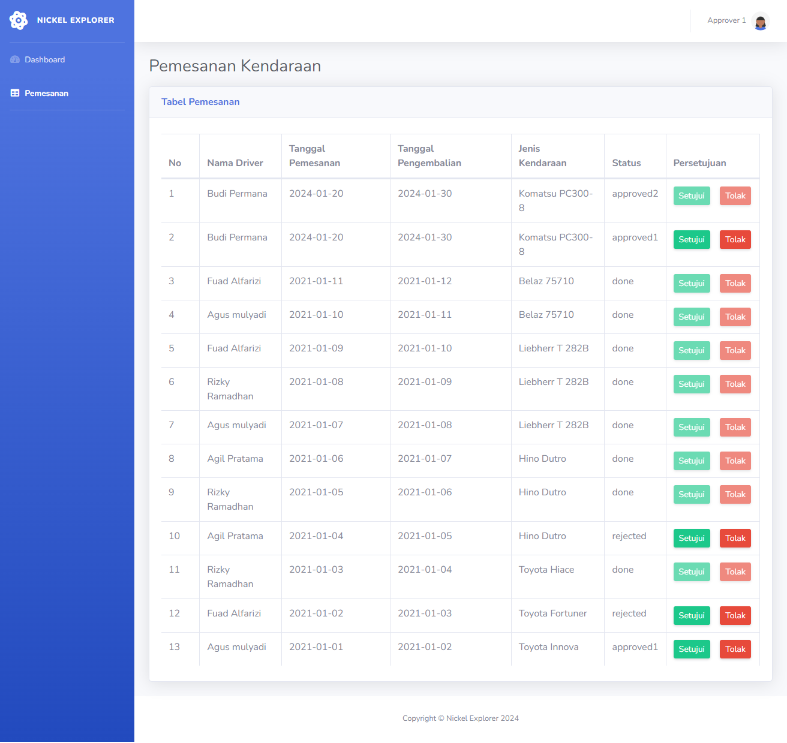
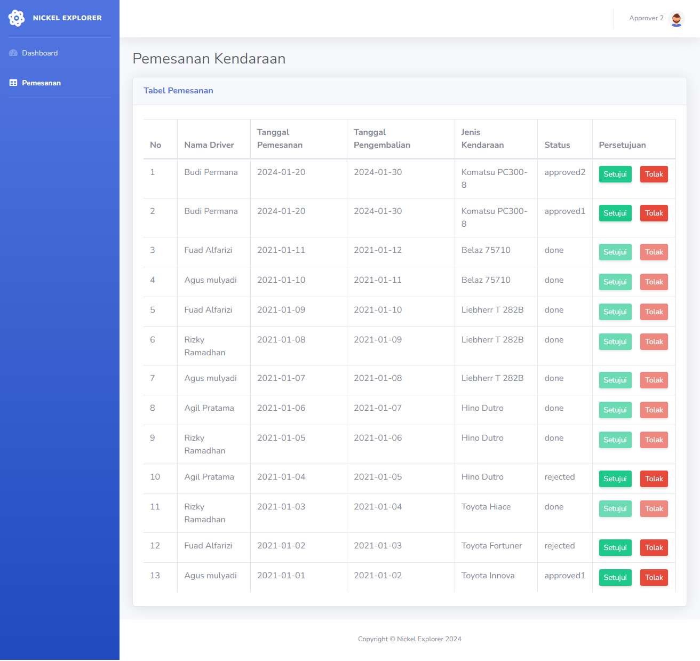

<p align="center">
    <a href="" rel="noopener">
        </a>
</p>

<h1 align="center" style="font-size:2rem;">Nickel Explorer</h1>

<p align="center" style="font-size:1.2rem;"> Aplikasi Pemesanan Kendaraan Perusahaan Tambang Nikel
    <br> 
</p>

## 📝 Table of Contents
- [About The Project](#about)
- [Fitur Aplikasi](#fitur)
- [Cara Menggunakan](#usage)
- [Panduan Penggunaan Aplikasi](#panduan)
- [Database Version](#database-version)
- [PHP Version](#php-version)
- [Framework Version](#framework-version)
- [Related Project](#related-project)

## 🧐 About The Project<a name = "about"></a>
Sebuah web aplikasi untuk dapat memonitoring kendaraan yang dimiliki. Untuk dapat memakai kendaraan, pegawai diwajibkan untuk melakukan pemesanan terlebih dahulu ke pool atau bagian pengelola kendaraan dan pemakaian kendaraan harus diketahui atau disetujui oleh masing - masing atasan.

## 🛠 **Fitur Aplikasi** <a name = "fitur"></a>
* Login
* Monitoring Grafik Pemakaian Kendaraan
* Pemesanan Kendaraan
* Persetujuan Pemesanan Kendaraan
* Export laporan periodik pemesanan kendaraan dalam bentuk Excel
* Log Aktivitas Pemesanan Kendaraan

## 🎈 Cara Menjalankan <a name="usage"></a>

**1. Clone the repository**
* ```git clone https://github.com/bintangsholu21/fsd-sekawanmedia-test.git```


**2. Switch to the repo folder**
* ```cd fsd-sekawanmedia-test```


**3. Install all the dependencies using composer**
* ```composer install```


**4. Copy the example env file and make the required configuration changes in the .env file**
* ```cp .env.example .env```


**5. Generate a new application key**

* ``php artisan key:generate``

**6. Create a new database in your MySQL database client**
* ```CREATE DATABASE fsd-sekawanmedia-test or anything you want dont forget to change .env file```


**7. Run the database migrations**
* ```php artisan migrate:fresh --seed```


**8. Start run dev**
* ```npm run dev```


**9. Start the local development server**
* ```php artisan serve```


<br>

## 📸 **Pandan Penggunaan Aplikasi** <a name = "panduan"></a>

#### 1. Login

</img>


> Tampilan login digunakan pengguna untuk masuk ke akun dengan memasukkan email dan password yang telah didaftarkan.


**ADMIN ACCOUNT**

admin dapat membuat pemesanan kendaraan dan melakukan konfirmasi selesai pemesanan kendaraan dan dapat melihat laporan pemesanan kendaraan.

* ```admin@gmail.com```
* ```admin```


**APPROVER 1 ACCOUNT**

Approver1 dapat melakukan persetujuan dan penolakan pemesanan kendaraan yang telah dilakukan oleh Admin.
* ```approver1@gmail.com```
* ```password1```


**APPROVER 2 ACCOUNT**

Approver2 dapat melakukan persetujuan dan penolakan pemesanan kendaraan yang telah dilakukan oleh Admin.
* ```approver2@gmail.com```
* ```password2```

<br>


#### 2. Dashboard
  
</img>

> Pada halaman dashboard ini, admin dapat melihat grafik pemakaian kendaraan yang telah disediakan oleh perusahaan. Grafik ini menampilkan jumlah pemakaian kendaraan per bulan. Admin juga dapat melihat jumlah pemesanan kendaraan yang belum disetujui dan pemesanan yang ditolak.
 <br>


#### 3. Daftar Pemesanan Kendaraan - Admin

</img>

> * Admin dapat melihat daftar pemesanan kendaraan yang telah dibuat. 
> * Admin dapat melakukan pencarian pemesanan kendaraan berdasarkan tanggal pemesanan, nama pegawai, dan status pemesanan.
> * Admin dapat melakukan konfirmasi pemesanan kendaraan yang telah selesai.
> * Admin dapat menambahkan pemesanan kendaraan baru.
> * Admin dapat mengunduh laporan pemesanan kendaraan dalam bentuk Excel.

<br>


#### 4. Aktivitas Pemesanan Kendaraan - Admin

</img>

> Admin dapat melihat log aktivitas pemesanan kendaraan yang telah dibuat. 

<br>

#### 5. Persetujuan Pemesanan Kendaraan - Approver 1

</img>

> Approver 1 dapat melihat daftar pemesanan kendaraan yang telah dibuat. Approver 1 hanya dapat menyetujui pemesanan kendaraan dengan status pending. Approver 1 tidak dapat menyetujui pemesanan kendaraan yang telah disetujui oleh Approver 2. Approver 1 juga dapat menolak pemesanan kendaraan yang telah dibuat.

<br>

#### 6. Persetujuan Pemesanan Kendaraan - Approver 2

</img>

> Approver 2 dapat melihat daftar pemesanan kendaraan yang telah dibuat. Approver 2 hanya dapat menyetujui pemesanan kendaraan dengan status approved1. Approver 2 tidak dapat menyetujui pemesanan kendaraan dengan status pending dan rejected. Approver 2 juga dapat menolak pemesanan kendaraan yang telah dibuat.


## Database Version <a name="database-version"></a>

* MySQL 5.7

## PHP Version <a name="php-version"></a>

* PHP version: 8.2.4

## Framework Version <a name="framework-version"></a>

* Laravel 10.0


## Related Project <a name="related-project"></a>

* [Physical Data Model](public/physical-data-model/pdm.md)
* [Activity Diagram](public/activity-diagram/activity-diagram.md)
* [UI/UX Design](public/ui-ux-design/ui-ux-design.md)

