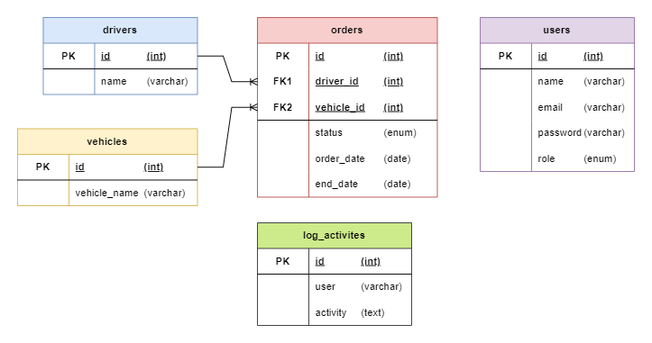

        

<h1 align="center" style="font-size:2rem;">Physical Data Model</h1>

 <i class="fas fa-atom"></i> Nickel Explorer
      

 

### 📑 Database Tables

1. **Users**
   - id (Primary Key)
   - name
   - email
   - password
   - role (admin, approver1, approver2)
   - created_at
   - updated_at

2. **Drivers**
   - id (Primary Key)
   - name
   - created_at
   - updated_at

3. **Vehicles**
   - id (Primary Key)
   - vehicle_name
   - created_at
   - updated_at

4. **Orders**
   - id (Primary Key)
   - user_id (Foreign Key ke Users)
   - driver_id (Foreign Key ke Drivers)
   - vehicle_id (Foreign Key ke Vehicles)
   - order_date
   - end_date
   - status (pending, approved1, approved2, rejected, done)
   - approved_by (Foreign Key ke Users)
   - created_at
   - updated_at

### 🔗 Database Relations

1. **Users - Orders**
   - Relasi One-to-Many: Seorang user dapat membuat banyak pesanan, tetapi setiap pesanan hanya dapat dimiliki oleh satu user.

2. **Drivers - Orders**
   - Relasi One-to-Many: Seorang driver dapat terkait dengan banyak pesanan, tetapi setiap pesanan hanya dapat terkait dengan satu driver.

3. **Vehicles - Orders**
   - Relasi One-to-Many: Sebuah kendaraan dapat terkait dengan banyak pesanan, tetapi setiap pesanan hanya dapat terkait dengan satu kendaraan.

4. **Users - Orders (Approved By)**
   - Relasi One-to-Many: Seorang user (admin) dapat menyetujui dan menyelesaikan banyak pesanan, tetapi setiap pesanan hanya dapat disetujui atau diselesaikan oleh satu user.
